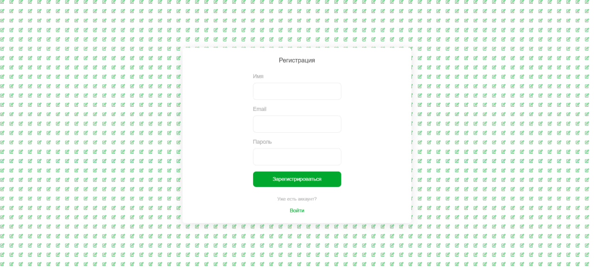
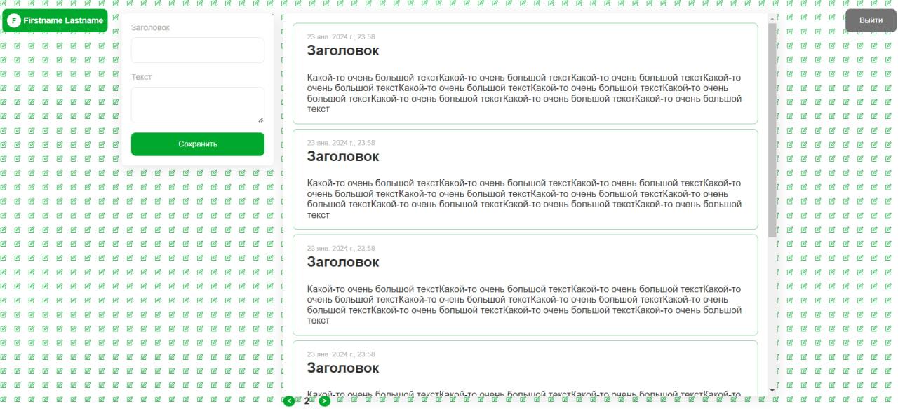

# Personal Notes App

Full-stack веб-приложение для создания и хранения личных заметок.

Пользователь может зарегистрироваться, войти в аккаунт и создавать заметки. Данные сохраняются на сервере и доступны после повторной авторизации.

## Возможности

- Регистрация пользователя
- Авторизация
- Выход из аккаунта
- Создание заметок
- Сохранение заметок на сервере
- Получение сохранённых заметок после повторного входа
- Валидация данных
- Работа с REST API
- Разделение frontend и backend

## Технологии

### Frontend

- React
- TypeScript
- Vite

### Backend

- Node.js
- Express
- TypeScript
- JWT
- LowDB
- Zod
- CORS
- Cookie Parser

## Структура проекта

```text
personal-notes-app/
├── client/      # React + TypeScript приложение
├── server/      # Express + TypeScript API
├── example/     # Скриншоты приложения
└── README.md
```

## Скриншоты

### Авторизация



### Список заметок



## Запуск проекта

### Backend

Перейти в папку `server`:

```bash
cd server
npm install
npm run dev
```

Сервер запускается на:

```text
http://localhost:4000
```

### Frontend

В отдельном терминале:

```bash
cd client
npm install
npm run dev
```

После запуска приложение будет доступно по адресу:

```text
http://localhost:5173
```

## Архитектура

Проект разделён на две части:

**Client** — пользовательский интерфейс на React и TypeScript.

**Server** — REST API на Express и TypeScript.

Frontend взаимодействует с backend через HTTP-запросы. Для авторизации используется JWT и cookies.

## GitHub

Исходный код проекта:

https://github.com/PurpleeHead/personal-notes-app
